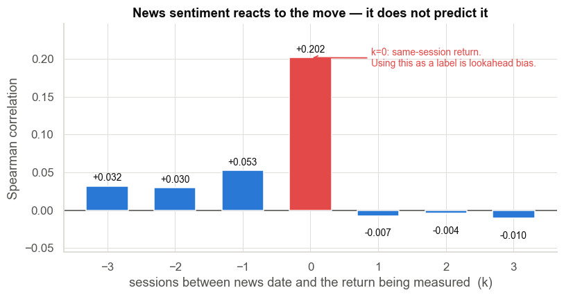
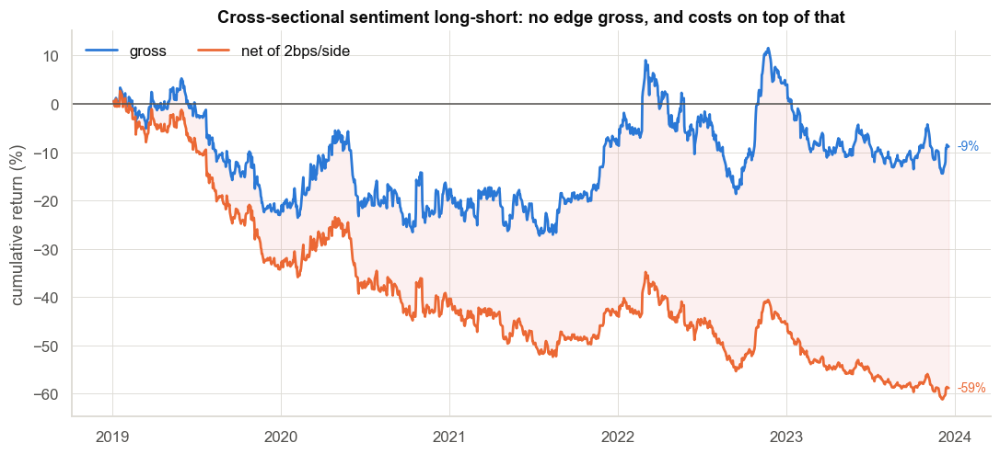
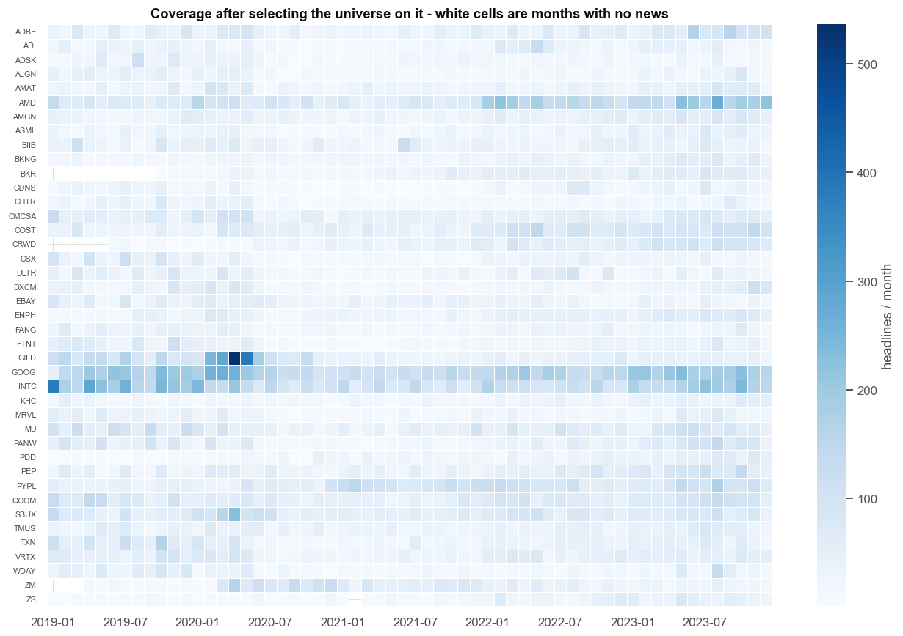
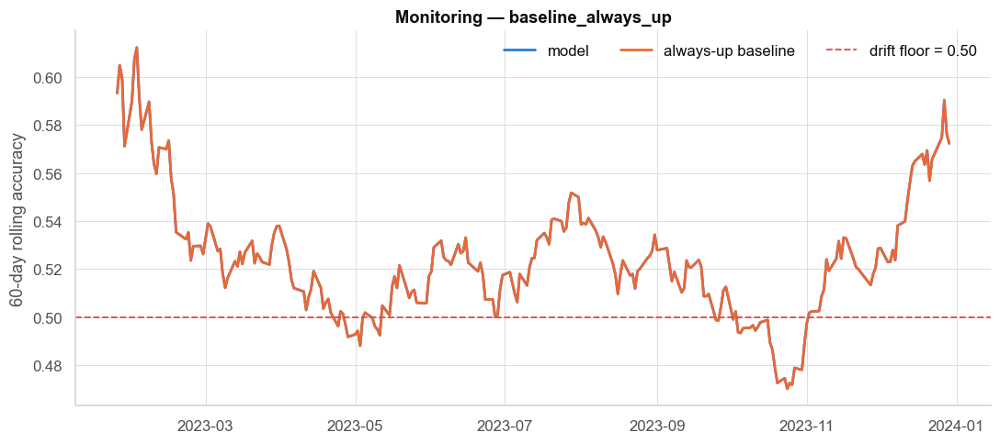

# Financial News Sentiment & Stock Signal Dashboard

A leakage-controlled pipeline that scores real financial headlines with a
Hugging Face transformer (FinBERT), joins them to daily prices in SQL, trains a
scikit-learn classifier for next-day direction, benchmarks it against honest
baselines, serves it from FastAPI, and monitors it for drift.

**Python · Transformers · scikit-learn · FastAPI · SQL · Pandas/NumPy · Matplotlib/Seaborn**

---

## The headline result

> **Sentiment dated day *D* correlates +0.218 with day *D*'s own return
> (p ≈ 1e-191), and −0.004 with day *D+1*'s.**
>
> Financial headlines mostly **report** moves rather than predict them. Once
> that is corrected for, **no model beats "always predict up."**

That is the finding, and the project is built to prove it rather than to hide it.
An earlier, sloppier version of this same code reports **58.9% accuracy** —
entirely from letting a day's headlines describe that day's return.

| Setup (identical model & features) | Accuracy | ROC AUC |
|---|---|---|
| Predict **this** session from today's news *(the common mistake)* | **0.5892** | **0.6063** |
| Predict **next** session from today's news *(honest)* | 0.5286 | 0.5022 |



---

## Hold-out results (2023, 8,205 ticker-days)

The bar every model must clear is **0.5250** — the rate at which these names
simply went up in 2023.

| Model | Accuracy | Balanced acc. | ROC AUC | Sharpe |
|---|---|---|---|---|
| `baseline_always_up` | **0.5250** | 0.5000 | 0.5000 | 0.85 |
| `hgb__sentiment_only` | 0.5196 | 0.4994 | 0.4940 | 0.69 |
| `hgb__combined` | 0.5180 | 0.5015 | 0.4983 | 0.40 |
| `hgb__price_only` | 0.5154 | 0.4993 | 0.4964 | 0.30 |
| `baseline_sentiment_sign` | 0.5051 | 0.4944 | 0.4940 | 0.23 |
| `logreg__combined` | 0.4946 | 0.4899 | 0.4914 | −0.34 |
| `baseline_ma_cross` | 0.4875 | 0.4838 | 0.4822 | −0.32 |

Every balanced accuracy sits within noise of 0.50 and every AUC within noise of
0.50. **Daily FinBERT headline sentiment carries no exploitable next-day
directional edge.** The `always_up` Sharpe of 0.85 is not skill — it is 2023's
rally.

Rank IC of `sent_mean` against the next-day return: **+0.0042 (p = 0.43)** over
35,526 ticker-days, and it flips sign by year (−0.011, +0.040, +0.018, −0.011,
−0.014). A signal that changes sign by regime is not a signal.

## Cross-sectional ranking — and what happened when the panel grew

Predicting *absolute* direction is dominated by the market factor. The better-posed
question is **which of these 41 names beats the others tomorrow** — ranking within
a day cancels the market, and the base rate becomes exactly **0.5000**, so accuracy
is honest. Features are z-scored within each date; the book is dollar-neutral,
long the top 3 and short the bottom 3, rebalanced daily.

**On an earlier 12-name universe this looked promising:** ranking on raw sentiment
gave mean IC **+0.0154** and a 2023 net Sharpe of **1.64**. That result did not
survive.

Expanding to 41 names — chosen by measured corpus coverage, giving 3.6× the panel
and √(41/12) ≈ 1.8× the breadth — drove every variant to zero:

| Model (2023 hold-out) | Accuracy | Mean IC | IC t-stat | Net Sharpe |
|---|---|---|---|---|
| `xs_logreg` | 0.4907 | −0.0010 | −0.07 | −1.50 |
| `xs_hgb` | 0.4947 | −0.0123 | −0.86 | −1.95 |
| `prior_composite` | 0.4936 | −0.0259 | −1.99 | −3.15 |
| `rank_by_sentiment` | 0.4990 | −0.0034 | −0.29 | −1.91 |
| `rank_by_sentiment` (full 1,245 days) | 0.4996 | **−0.0024** | −0.41 | −0.77 |

**More data made the effect disappear, which is the signature of no effect.** A
real edge gets *more* significant with more observations; noise regresses to zero.
The 12-name +0.0154 was small-sample luck on a badly-covered universe.



Gross −9% cumulative over five years, net −59% after costs at ~150% daily turnover.
There is no edge to consume before costs are even applied.

### Why the learned models underperformed the unfitted rule

On the 12-name panel the fitted models posted *negative* IC while a zero-parameter
rule posted positive IC. Diagnosing that is the most transferable result here:

1. **The fitted sign was a coin flip.** Refitting each year, the coefficient on
   `sent_mean` was −0.032, −0.027, +0.006, −0.009. The model estimates a parameter
   the data cannot determine, then applies the wrong guess out of sample.
2. **Collinearity split the weight arbitrarily.** `sent_mean`, `sent_net`,
   `sent_surprise` and `sent_ewma3` correlate at 0.75–0.91. The fit put −0.034 on
   `sent_pos_frac` and +0.037 on `sent_neg_frac` — both inverted, and mutually
   cancelling.
3. **Selecting a fix on the test set *is* overfitting.** Eight candidate repairs
   were tried. The apparent winner (3 decorrelated features, IC +0.009 on 2023)
   reversed to **−0.021** under walk-forward across 2020–2023.

The fixes applied — a single sentiment composite instead of six collinear columns,
weights shrunk toward a stated economic prior rather than freely estimated, and
shrinkage strength selected by walk-forward on *training data only*
(`select_lambda_walkforward`) — are in `cross_sectional.py`. They are the right
structural response. They did not manufacture a signal, because there is none.

## Data

| | |
|---|---|
| **Headlines** | 116,250 real Nasdaq.com articles, 2019‑01‑02 → 2023‑12‑29, from [FNSPID](https://huggingface.co/datasets/benstaf/FNSPID-filtered-nasdaq-100) |
| **Prices** | 54,018 daily bars from Yahoo Finance (Stooq fallback), split/dividend adjusted |
| **Universe** | 41 NASDAQ-100 names with ≥80% monthly headline coverage and ≥1,200 headlines |
| **Panel** | 35,526 ticker-days after feature warm-up and filtering |
| **Sentiment** | `ProsusAI/finbert`, ~750 headlines/sec on Apple MPS |

The universe is chosen by **measured corpus coverage**, not brand recognition.
A ticker is included only if it has headlines in ≥80% of months across 2019–2023
and ≥1,200 headlines in total.



This matters more than it sounds. The famous mega-caps are *badly* covered by
FNSPID: META has zero rows, NVDA has 13 consecutive zero-headline months
(2020‑07 → 2021‑07), and AAPL, MSFT and AMZN have almost nothing before 2022.
**Only 6 of an earlier 12-name liquid universe clear the coverage bar.** Dropping
AAPL and NVDA from a stock project feels wrong right up until you measure how
little the corpus says about them — at which point keeping them is the mistake.

Two names (EA, WBA) meet the coverage bar but were taken private in 2025, so no
price vendor serves them any more. That is a *reverse*-survivorship limitation
worth naming: the dataset cannot study the companies that left.

## Quick start

```bash
python3.12 -m venv .venv && source .venv/bin/activate
pip install -r requirements.txt && pip install -e .

python -m fns.cli all      # ingest → score → features → analyse → train → monitor → plots
python -m fns.cli serve    # dashboard at http://127.0.0.1:8000
```

First run downloads ~1 GB (headline corpus + FinBERT weights) and takes roughly
10 minutes; everything is cached, so later runs take seconds. No API keys.

Individual stages (each idempotent and separately re-runnable):

```bash
python -m fns.cli ingest      # prices + headlines  (prices FIRST: they define the trading calendar)
python -m fns.cli score       # FinBERT; skips anything already scored
python -m fns.cli features    # build the modelling table
python -m fns.cli analyse     # lead-lag, information coefficient, quantile buckets
python -m fns.cli train       # baselines + logreg/HGB, ablated by feature block
python -m fns.cli monitor     # rolling accuracy + PSI drift
python -m fns.cli experiment  # the leaky-vs-honest comparison
pytest -q                     # 13 tests
```

---

## How correctness is enforced

**1. Point-in-time attribution.** `ingest/headlines.py:assign_trade_date()`
converts each UTC timestamp to US/Eastern, rolls anything at/after the 16:00
bell to the next session, snaps to the **real** trading calendar (read back out
of the `prices` table, so holidays are exact), then applies one extra session of
lag. That last step is not paranoia — it is what the lead-lag study demands.

**2. Chronological splits everywhere.** Train 2019–2022, test 2023. Tuning uses
`TimeSeriesSplit`. A random split on a 12-name panel would put NVDA's Tuesday in
train and AAPL's Tuesday in test, leaking the market factor.

**3. Baselines reported beside every number.** `always_up`, MA-crossover, and
raw sentiment sign.

**4. Ablation by feature block.** Sentiment-only vs price-only vs combined — the
only way to tell "sentiment works" from "momentum works and sentiment came along".

**5. Economics, not just accuracy.** Mean return in bps and Sharpe, gross of
costs (stated, not hidden — daily turnover at ~1–2 bps/side would consume these).

**6. Tests on the invariants that fail silently.** Weekend/holiday rollover,
`fwd_ret_1d` equalling the true next-session return, upsert idempotency, PSI
behaviour, and a guard on FinBERT's non-alphabetical label order.

---

## Architecture

```
FNSPID parquet ─┐
                ├─► headlines ──► FinBERT ──► sentiment ─┐
Yahoo/Stooq ────┴─► prices ──────────────────────────────┼─► features ─► train ─► predictions
                                                          │                          │
                                                          └──────────► monitor ◄──────┘
                                                                          │
                                                              FastAPI + dashboard
```

```
src/fns/
├── config.py            one source of truth for universe, dates, cutoff, lag
├── db.py                SQLAlchemy Core schema + dialect-native UPSERT
├── ingest/
│   ├── prices.py        yfinance + Stooq fallback, adjusted closes
│   └── headlines.py     corpus load, cleaning, SESSION ATTRIBUTION
├── sentiment/finbert.py batched GPU inference, SQL-cached by content hash
├── features.py          sentiment aggregates + price controls + label
├── analysis.py          lead-lag, information coefficient, quantile buckets
├── baselines.py         always-up, MA crossover, sentiment sign
├── train.py             chronological split, ablation, benchmarking
├── experiments.py       the leaky-vs-honest comparison
├── monitor.py           rolling accuracy + PSI drift alerting
├── plots.py             Matplotlib/Seaborn figures
├── api/main.py          FastAPI + Jinja dashboard
└── cli.py               `python -m fns.cli <stage>`
```

Six SQL tables: `headlines`, `sentiment`, `prices`, `features`, `predictions`,
`monitor_log`. SQLite by default; set `FNS_DB_URL` to point the same code at
Postgres.

---

## Monitoring

Two signals, because they fail differently:

* **Rolling directional accuracy** — ground truth, but slow to become
  significant at a ~50% base rate.
* **Population Stability Index** on the sentiment distribution — a leading
  indicator that fires the day the *input* shifts, before enough outcomes exist
  to prove accuracy fell.

Current state on 2023 data: **WARN** — rolling accuracy 0.508 against an
always-up baseline of 0.572. The monitor correctly refuses to certify a model
that does not beat its baseline.

PSI on sentiment is **0.054**, comfortably inside tolerance. On the earlier
12-name universe it was **0.325** — a major drift alert driven almost entirely by
those coverage holes rather than by any real change in the news. Fixing the
universe fixed the drift, which is a good illustration of the monitor pointing at
a genuine data problem rather than a model problem.



---

## Known limitations

* **One corpus, date-only timestamps.** FNSPID stamps every article at 00:00
  UTC, so intraday precision is impossible; the extra session of lag is the
  conservative response. Real intraday timestamps would let the cutoff do the
  work and would likely recover some decayed signal.
* **41 large caps.** The most efficiently-priced names in the market — the
  hardest place to find news alpha. Small caps would be a fairer test.
* **Survivorship, in both directions.** The universe is drawn with hindsight from
  today's index, and names that were delisted (EA, WBA) cannot be priced at all.
* **Gross of costs.** No spread, slippage or borrow.
* **FinBERT scores tone, not surprise.** "Beats by $0.02" and "beats by $2.00"
  read alike; the market only cares about the gap to expectations.

## Next steps

~~Cross-sectional ranking~~ and ~~breadth expansion~~ — both built, see above.
Remaining: intraday timestamps and
minute-bar reaction windows; event-type classification (earnings/guidance/legal)
so tone is conditioned on what kind of news it is; analyst-estimate data to turn
tone into surprise.

## Licence & attribution

Code MIT. Headlines: FNSPID (CC-BY-4.0). Prices: Yahoo Finance / Stooq, personal
research use. Model: `ProsusAI/finbert`.
